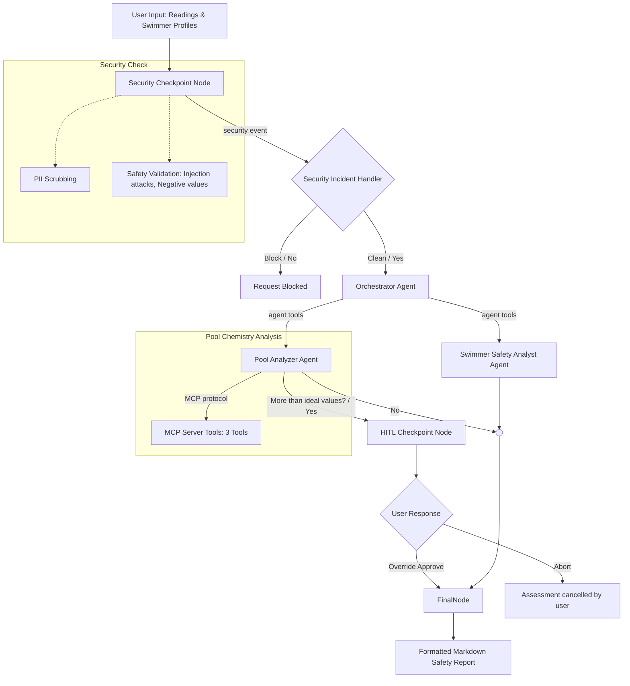

# SwimSafe AI: Project Overview & Technical Documentation

SwimSafe AI is an agentic safety advisor that bridges the gap between raw pool chemistry readings and individual biological tolerances. Built using the Google Agent Development Kit (ADK) and Gemini 2.5 Flash, the system analyzes pool diagnostics alongside swimmer health histories to generate personalized safety verdicts, custom precautions, and automated facility manager alerts.

---

## 1. The Core Problem
Traditional swimming pool safety relies on a single set of standardized ranges (e.g., maintaining free chlorine between 1.0 and 3.0 ppm, and pH between 7.2 and 7.8). However, these universal metrics ignore a critical variable: **the swimmers themselves**.

*   **Asthma & Breathing Sensitivity**: High chloramines or unventilated indoor chlorine vapors can trigger severe bronchoconstriction in asthmatics, even when the free chlorine level is technically "within range."
*   **Eczema & Dermatitis**: Slightly acidic or basic pH levels can aggravate sensitive skin, causing severe breakouts or eczema flares.
*   **Allergies & Pathogens**: Swimmers with severe chlorine allergies require strict precautions. Conversely, critically low chlorine levels fail to kill bacteria, which poses an immediate hazard to individuals with recent illnesses or open cuts.
*   **Facility Safety**: Apartment complexes, hotels, and gyms need immediate, automated alerts sent to facility managers when water chemistry drifts into toxic or corrosive ranges.

### The Documented Knowledge Gap
This gap in pool chemistry awareness is backed by real-world surveys:
*   **The Leslie's Harris Poll Survey**: Found that **61% of Americans are unfamiliar with proper pool care**, and **71% mistakenly believe that clear water automatically means clean water**. This creates a dangerous, false sense of security, as water can look perfectly clear while hosting dangerous chemical imbalances or active pathogens.
*   **Testing and Contamination Habits**: Another survey revealed that **23% of pool owners test their water less often than once every two weeks** (far below the CDC's recommended frequency), and over half did not realize everyday cosmetics like sunscreen, deodorant, or makeup directly degrade pool chemistry.

### Real-World Public Health Impact
This knowledge gap results in severe, documented health hazards:
*   **Parasitic Outbreaks (Cryptosporidium)**: The CDC has officially recorded dozens of real outbreaks where the chlorine-resistant parasite *Cryptosporidium* spread through pools and splash pads, making thousands of people sick and leading to hundreds of hospitalizations. It is the leading cause of pool-related illness outbreaks tracked by the CDC.
*   **Pool Chemical Injuries**: On the chemical side, approximately **4,500 people go to the emergency room every single year** in the United States alone due to pool chemical injuries (such as chemical burns or inhaling toxic gases from mixing chemicals improperly), and more than a third of these emergency cases are children or teenagers.
*   **Asthma Risk and Scientific Uncertainty**: Scientific research indicates a potential link between young children swimming frequently in indoor chlorinated pools and an increased risk of developing asthma. However, this is an area of active study and is not yet fully settled—a recent study found no link at all. SwimSafe AI acknowledges this scientific uncertainty by warning sensitive users without treating the connection as a proven fact, offering honest and transparent guidance.

SwimSafe AI solves this by coordinating specialized AI agents to analyze water metrics, evaluate health histories, and output tailored safety guidelines.

---

## 2. System Architecture & Workflow
The application runs as a directed graph workflow, ensuring that data validation, multi-agent coordination, and human reviews happen in a secure, logical order.

### Stage A: Input & The Security Checkpoint
When pool readings and swimmer profiles are submitted:
1.  **PII Redaction**: Regular expressions scrub any inadvertent email addresses or phone numbers.
2.  **Prompt Injection Mitigation**: Key phrases trying to override system boundaries are flagged.
3.  **Physical Feasibility Validation**: Checks if readings are physically impossible (e.g., a negative pH value).
4.  *Routing*: If a security risk is found, it routes to the **Security Incident Handler** which immediately blocks the request. Otherwise, it proceeds to the Orchestrator.

### Stage B: Orchestration & Agent Specialization
The **Orchestrator Agent** acts as the central coordinator, delegating analysis to two sub-agents:
1.  **Pool Analyzer Agent**: Evaluates chemical parameters (Chlorine, pH, Cyanuric Acid, Clarity, Location) using local guidelines.
2.  **Swimmer Safety Analyst Agent**: Compares the pool's chemistry output against the swimmers' specific age groups, swimming abilities, and health conditions (eczema, asthma, cuts, illnesses).

### Stage C: Human-in-the-Loop (HITL) Checkpoint
If the Pool Analyzer flags the water chemistry as critically hazardous (e.g. Free Chlorine > 10.0 ppm or a contamination incident):
1.  The workflow **suspends execution** and raises an interrupt.
2.  The user is shown a browser confirmation popup warning them of the hazard.
3.  **If Aborted**: The workflow stops, and the UI displays an **Assessment Cancelled** screen.
4.  **If Overridden**: The user accepts the risk, and the workflow resumes to generate the safety report with warning alerts.

### Stage D: Final Response Node
This node receives the output from the agents (or the approved override) and compiles it into a markdown safety report featuring overall verdicts, swimmer precautions, and manager alerts.

---

## 3. Model Context Protocol (MCP) Server
To avoid LLM hallucinations regarding pool chemistry numbers and to run math logic securely, the system integrates a stdio-based MCP Server ([app/mcp_server.py](file:///Users/sowmyaguda/Downloads/agents_capstone_project/swimsafe-ai/app/mcp_server.py)). The server registers three primary tools:

1.  **`get_chemical_guidelines`**: Returns the official chemical thresholds for swimming pool and hot tub water (Free Chlorine: 1.0–3.0 ppm, pH: 7.2–7.8, Stabilizer/CYA: 30–50 ppm, and absolute limits).
2.  **`diagnose_water_issues`**: Inspects chlorine, pH, and clarity to detect anomalies (like algae bloom risk or calcium scaling) and suggests chemical adjustments.
3.  **`calculate_lsi`**: Evaluates the **Langelier Saturation Index (LSI)** to check if water is corrosive (damaging concrete/metals) or scaling (clogging filters). 
    $$\text{LSI} = \text{pH} + \text{TF} + \text{CF} + \text{AF} - 12.1$$
    *(where TF is Temperature Factor, CF is Calcium Factor, and AF is Alkalinity Factor corrected for Cyanuric Acid).*

---

## 4. Technical Stack
*   **Orchestration Framework**: Google Agent Development Kit (ADK) 2.0
*   **Underlying Model**: Gemini 2.5 Flash
*   **Verification**: Pydantic models for structured output serialization
*   **Backend Web Server**: FastAPI and Uvicorn
*   **Database & States**: `InMemorySessionService` for state tracking
*   **Frontend Dashboard**: Vanilla HTML5, CSS3, and JavaScript (no frameworks)
*   **Package Manager**: `uv`

---

## 5. Development Tools & Scaffolding
*   **Agents CLI**: Used to bootstrap the project structure, run test suites, and deploy the developer playground.
*   **Antigravity AI IDE**: Used as the AI pair programmer to code backend routes, design the CSS theme, resolve state-retrieval bugs on graph resume, and manage Git version control.
*   **ADK Playground**: Runs on port `18081` to let developers inspect workflow traces, visualize graph nodes, and review prompt inputs in real-time.
