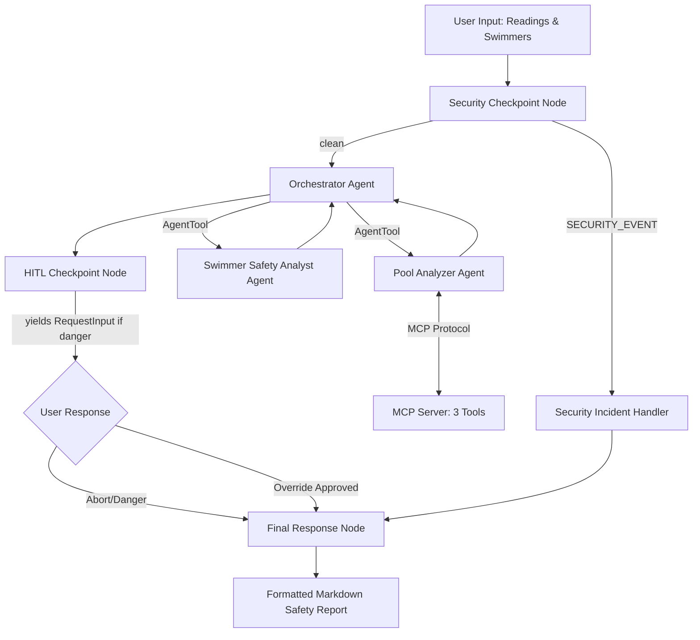
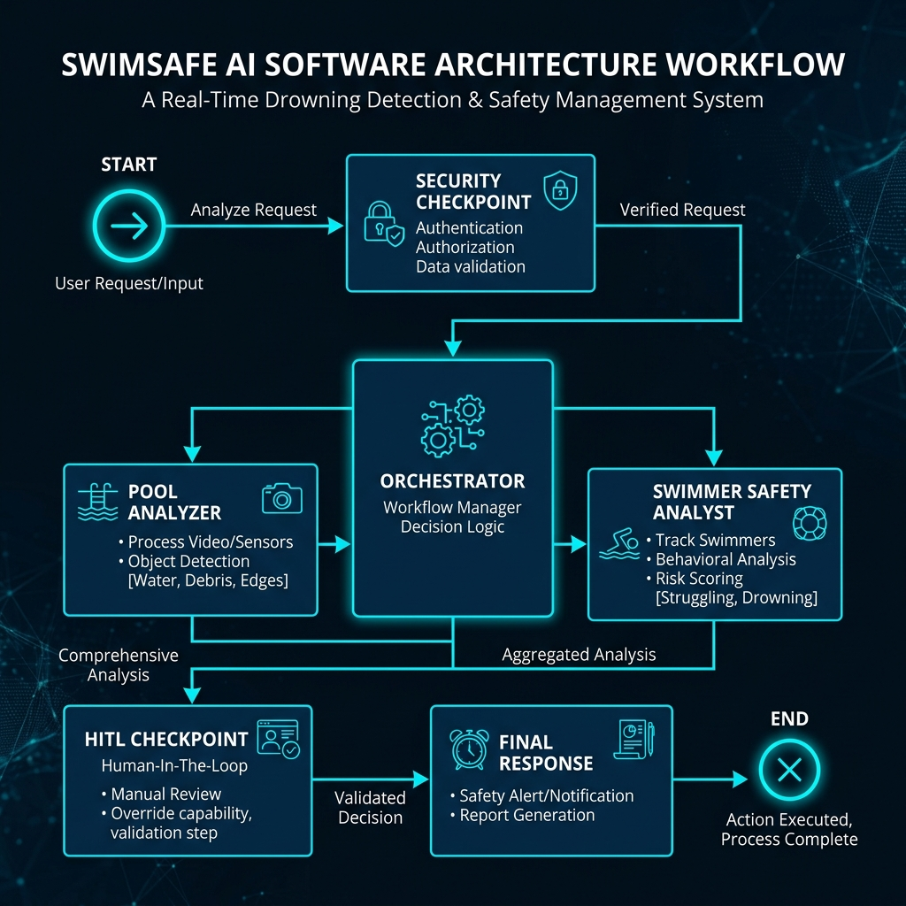

# SwimSafe AI Agent 🏊

A personalized swim/no-swim safety advisor that analyzes pool chemical metrics against swimmer health profiles to make smart, personalized safety verdicts.

## Prerequisites
- **Python**: Version 3.11 or higher (3.11–3.13 recommended)
- **uv**: Python package manager
- **Gemini API Key**: Obtain one from [Google AI Studio](https://aistudio.google.com/apikey)

## Quick Start
1. Clone this repository:
   ```bash
   git clone <repo-url>
   cd pool-sense
   ```
2. Set up environment:
   ```bash
   cp .env.example .env
   # Open .env and add your GOOGLE_API_KEY
   ```
3. Install dependencies:
   ```bash
   make install
   ```
4. Run the playground:
   ```bash
   make playground
   # Open http://localhost:18081 in your browser
   ```

## Architecture Diagram


## How to Run
- Run the interactive playground UI:
  ```bash
  make playground
  ```
- Run the FastAPI server:
  ```bash
  make run
  ```

## Sample Test Cases

### Test Case 1: Healthy Group in Balanced Pool
- **Input**:
  ```json
  {
    "pool_readings": {
      "free_chlorine": 2.0,
      "ph": 7.4,
      "cyanuric_acid": 40.0,
      "water_clarity": "clear",
      "strong_chemical_smell": false,
      "indoor_outdoor": "outdoor",
      "recent_rain_heavy_use": false,
      "contamination_incident": false
    },
    "swimmers": [
      {
        "name": "Alice",
        "age_group": "adult",
        "swimming_ability": "strong",
        "allergies": null,
        "asthma_breathing_sensitivity": false,
        "sensitive_skin_eczema": false,
        "eye_sensitivity": false,
        "open_cuts_wounds": false,
        "recent_illness": false
      }
    ]
  }
  ```
- **Expected Route/Verdict**: `safe` for all swimmers and `safe` pool.
- **Check**: View the report output in playground. Overall verdict should be **SAFE**.

### Test Case 2: Sensitive Swimmer in Balanced Pool
- **Input**:
  ```json
  {
    "pool_readings": {
      "free_chlorine": 2.0,
      "ph": 7.4,
      "cyanuric_acid": 40.0,
      "water_clarity": "clear",
      "strong_chemical_smell": false,
      "indoor_outdoor": "outdoor",
      "recent_rain_heavy_use": false,
      "contamination_incident": false
    },
    "swimmers": [
      {
        "name": "Bobby",
        "age_group": "child",
        "swimming_ability": "average",
        "allergies": "chlorine skin allergy",
        "asthma_breathing_sensitivity": true,
        "sensitive_skin_eczema": true,
        "eye_sensitivity": true,
        "open_cuts_wounds": false,
        "recent_illness": false
      }
    ]
  }
  ```
- **Expected Route/Verdict**: Overall **CAUTION** or **NOT RECOMMENDED** for Bobby due to asthma, eczema, and skin allergies. 
- **Check**: Individual swimmer guidance warning Bobby about potential skin irritation and recommending goggles or short swim time.

### Test Case 3: Toxic/Danger Pool Level (Triggers HITL)
- **Input**:
  ```json
  {
    "pool_readings": {
      "free_chlorine": 12.0,
      "ph": 6.8,
      "cyanuric_acid": 120.0,
      "water_clarity": "cloudy",
      "strong_chemical_smell": true,
      "indoor_outdoor": "indoor",
      "recent_rain_heavy_use": true,
      "contamination_incident": false
    },
    "swimmers": [
      {
        "name": "Charlie",
        "age_group": "senior",
        "swimming_ability": "weak",
        "allergies": null,
        "asthma_breathing_sensitivity": false,
        "sensitive_skin_eczema": false,
        "eye_sensitivity": false,
        "open_cuts_wounds": false,
        "recent_illness": false
      }
    ]
  }
  ```
- **Expected Route/Verdict**: Triggers the **HITL (Human-in-the-loop)** prompt: "⚠️ DANGER WARNING: The pool conditions are flagged as DANGEROUS!..."
- **Check**: The agent will pause execution, prompt for 'yes' or 'no', and return aborted status if 'no' is selected.

## Troubleshooting

1. **Error: "No agents found" or "Got unexpected extra arguments"**
   - Relaunch the playground from the project root using `make playground`. Avoid direct `adk web` runs that might conflict with wildcard settings.
2. **Error: `ModuleNotFoundError: No module named 'mcp'`**
   - Ensure you run `make install` or `uv sync` first to download all pinned packages.
3. **Error: API 404/Quota Error**
   - Switch model in the top-right model selector of Antigravity IDE (e.g. from `pro` to `flash` or `flash-lite`).

## Push to GitHub

1. Create a new repo at https://github.com/new
   - Name: pool-sense
   - Visibility: Public or Private
   - Do NOT initialize with README (you already have one)

2. In your terminal, navigate into your project folder:
   ```bash
   cd pool-sense
   git init
   git add .
   git commit -m "Initial commit: pool-sense ADK agent"
   git branch -M main
   git remote add origin https://github.com/<your-username>/pool-sense.git
   git push -u origin main
   ```

3. Verify .gitignore includes:
   ```
   .env          ← your API key — must NEVER be pushed
   .venv/
   __pycache__/
   *.pyc
   .adk/
   ```

⚠ NEVER push .env to GitHub. Your API key will be exposed publicly.

## Demo Script
You can read the spoken presentation script for a 3-4 minute walkthrough in [DEMO_SCRIPT.txt](DEMO_SCRIPT.txt).

## Assets

### Cover Page Banner


### Architecture Diagram


