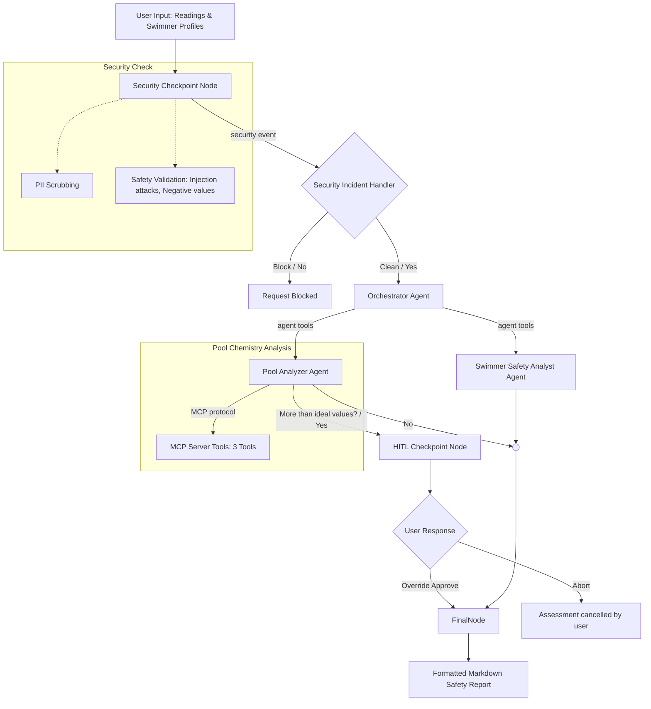
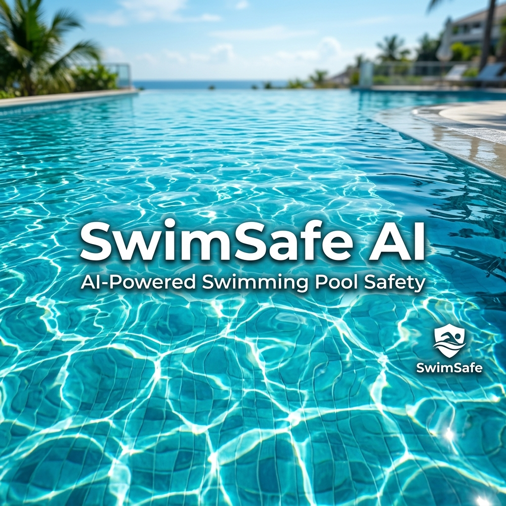

# SwimSafe AI Agent 🏊

A personalized swim/no-swim safety advisor that analyzes pool chemical metrics against swimmer health profiles to make smart, personalized safety verdicts.

## Prerequisites & API Key Setup
1. **Python**: Version 3.11 or higher (3.11–3.13 recommended).
2. **uv**: Fast Python package manager. If you don't have it, install it by running:
   - **macOS/Linux**: `curl -LsSf https://astral.sh/uv/install.sh | sh`
   - **Windows**: `powershell -c "irm https://astral.sh/uv/install.ps1 | iex"`
3. **Gemini API Key**: 
   - Go to [Google AI Studio API Keys](https://aistudio.google.com/apikey).
   - Sign in with your Google account.
   - Click **Create API Key** and copy the generated key.

## Quick Start
1. Clone this repository:
   ```bash
   git clone https://github.com/sowmyaguda/SwimsafeAI.git
   cd swimsafe-ai
   ```
2. Set up your environment file:
   - **macOS/Linux**:
     ```bash
     cp .env.example .env
     ```
   - **Windows (Command Prompt / CMD)**:
     ```cmd
     copy .env.example .env
     ```
   - **Windows (PowerShell)**:
     ```powershell
     Copy-Item .env.example .env
     ```
   - Open `.env` in a text editor and add your copied key:
     ```env
     GOOGLE_API_KEY=your_actual_api_key_here
     ```
3. Install dependencies:
   - **macOS/Linux**:
     ```bash
     make install
     ```
   - **Windows**:
     ```powershell
     uv sync
     ```

---

## Architecture Diagram


---

## Model Context Protocol (MCP) Server
SwimSafe AI integrates an MCP Server to decouple pool chemistry guidelines and diagnostic algorithms from the main LLM orchestration. The server is implemented in [app/mcp_server.py](file:///Users/sowmyaguda/Downloads/agents_capstone_project/swimsafe-ai/app/mcp_server.py) using `FastMCP`.

It exposes **3 core tools** to the Pool Analyzer Agent:
1. **`get_chemical_guidelines`**: 
   * **What it does**: Returns official pool safety thresholds (e.g., Free Chlorine: 1.0–3.0 ppm, pH: 7.2–7.8, Stabilizer/CYA: 30–50 ppm, and absolute maximums for swimming).
   * **Why it's used**: Ensures the agent relies on precise, verified chemical boundaries rather than LLM hallucination.
2. **`diagnose_water_issues`**:
   * **What it does**: Diagnoses common pool water anomalies (like low chlorine, acidic pH, or cloudy water scaling) and outputs clear corrective recommendations.
   * **Why it's used**: Translates raw metrics into structured diagnostic suggestions.
3. **`calculate_lsi`** (Langelier Saturation Index):
   * **What it does**: Calculates LSI water stability using pH, temperature, calcium hardness, total alkalinity, and cyanuric acid. 
   * **Why it's used**: Classifies water as corrosive, scaling, or balanced.

---

## How to Run

### Option A: Custom Web Dashboard (Recommended)
Run the backend API and serve the styled web application dashboard:
- **macOS/Linux**:
  ```bash
  make run
  ```
- **Windows**:
  ```powershell
  uv run uvicorn app.fast_api_app:app --host 127.0.0.1 --port 8080
  ```

Open **[http://localhost:8080/dashboard/](http://localhost:8080/dashboard/)** in your web browser. This features a beautiful single-page dashboard for registering/editing swimmer profiles, accessing inline chemistry help tooltips, and getting Safety verdicts.

### Option B: Interactive Playground UI
Run the built-in ADK development playground:
- **macOS/Linux**:
  ```bash
  make playground
  ```
- **Windows**:
  ```powershell
  uv run adk web app --host 127.0.0.1 --port 18081 --reload_agents
  ```

Open **[http://localhost:18081](http://localhost:18081)** in your browser.

## Sample Test Cases

### Test Case 1: Healthy Group in Balanced Pool
- **Input**:
  ```json
  {
    "pool_readings": {
      "free_chlorine": 2.0,
      "ph": 7.4,
      "cyanuric_acid": 40.0,
      "water_clarity": "clear",
      "strong_chemical_smell": false,
      "indoor_outdoor": "outdoor",
      "recent_rain_heavy_use": false,
      "contamination_incident": false
    },
    "swimmers": [
      {
        "name": "Alice",
        "age_group": "adult",
        "swimming_ability": "strong",
        "allergies": null,
        "asthma_breathing_sensitivity": false,
        "sensitive_skin_eczema": false,
        "eye_sensitivity": false,
        "open_cuts_wounds": false,
        "recent_illness": false
      }
    ]
  }
  ```
- **Expected Route/Verdict**: `safe` for all swimmers and `safe` pool.
- **Check**: View the report output in playground. Overall verdict should be **SAFE**.

### Test Case 2: Sensitive Swimmer in Balanced Pool
- **Input**:
  ```json
  {
    "pool_readings": {
      "free_chlorine": 2.0,
      "ph": 7.4,
      "cyanuric_acid": 40.0,
      "water_clarity": "clear",
      "strong_chemical_smell": false,
      "indoor_outdoor": "outdoor",
      "recent_rain_heavy_use": false,
      "contamination_incident": false
    },
    "swimmers": [
      {
        "name": "Bobby",
        "age_group": "child",
        "swimming_ability": "average",
        "allergies": "chlorine skin allergy",
        "asthma_breathing_sensitivity": true,
        "sensitive_skin_eczema": true,
        "eye_sensitivity": true,
        "open_cuts_wounds": false,
        "recent_illness": false
      }
    ]
  }
  ```
- **Expected Route/Verdict**: Overall **CAUTION** or **NOT RECOMMENDED** for Bobby due to asthma, eczema, and skin allergies. 
- **Check**: Individual swimmer guidance warning Bobby about potential skin irritation and recommending goggles or short swim time.

### Test Case 3: Toxic/Danger Pool Level (Triggers HITL)
- **Input**:
  ```json
  {
    "pool_readings": {
      "free_chlorine": 12.0,
      "ph": 6.8,
      "cyanuric_acid": 120.0,
      "water_clarity": "cloudy",
      "strong_chemical_smell": true,
      "indoor_outdoor": "indoor",
      "recent_rain_heavy_use": true,
      "contamination_incident": false
    },
    "swimmers": [
      {
        "name": "Charlie",
        "age_group": "senior",
        "swimming_ability": "weak",
        "allergies": null,
        "asthma_breathing_sensitivity": false,
        "sensitive_skin_eczema": false,
        "eye_sensitivity": false,
        "open_cuts_wounds": false,
        "recent_illness": false
      }
    ]
  }
  ```
- **Expected Route/Verdict**: Triggers the **HITL (Human-in-the-loop)** prompt: "⚠️ DANGER WARNING: The pool conditions are flagged as DANGEROUS!..."
- **Check**: The agent will pause execution, prompt for 'yes' or 'no', and return aborted status if 'no' is selected.

## Troubleshooting

1. **Error: "No agents found" or "Got unexpected extra arguments"**
   - Relaunch the playground from the project root using `make playground`. Avoid direct `adk web` runs that might conflict with wildcard settings.
2. **Error: `ModuleNotFoundError: No module named 'mcp'`**
   - Ensure you run `make install` or `uv sync` first to download all pinned packages.
3. **Error: API 404/Quota Error**
   - Switch model in the top-right model selector of Antigravity IDE (e.g. from `pro` to `flash` or `flash-lite`).

## Push to GitHub

1. Create a new repo at https://github.com/new
   - Name: SwimsafeAI
   - Visibility: Public or Private
   - Do NOT initialize with README (you already have one)

2. In your terminal, navigate into your project folder:
   ```bash
   cd swimsafe-ai
   git init
   git add .
   git commit -m "Initial commit: SwimSafe AI Agent"
   git branch -M main
   git remote add origin https://github.com/sowmyaguda/SwimsafeAI.git
   git push -u origin main
   ```

3. Verify .gitignore includes:
   ```
   .env          ← your API key — must NEVER be pushed
   .venv/
   __pycache__/
   *.pyc
   .adk/
   ```

⚠ NEVER push .env to GitHub. Your API key will be exposed publicly.

## Demo Script
You can read the spoken presentation script for a 3-4 minute walkthrough in [DEMO_SCRIPT.txt](DEMO_SCRIPT.txt).

## Assets

### Cover Page Banner


